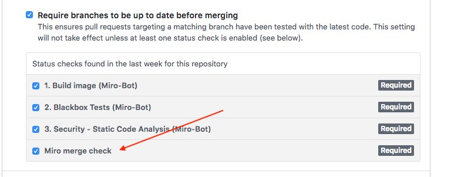

 [](https://github.com/Soluto/Miro)   


# MIRO - Merge it robot!
Miro was designed to help merge code from Github Pull Requests.

<!-- TOC -->

- [MIRO - Merge it robot!](#miro---merge-it-robot)
    - [Deploying](#deploying)
    - [How does it work](#how-does-it-work)
        - [Miro Merge Command](#miro-merge-command)
        - [Miro Cancel Command](#miro-cancel-command)
        - [Miro Info Command](#miro-info-command)
        - [Miro WIP Command](#miro-wip-command)
    - [Additional Features](#additional-features)
        - [Optional repository Config File - .miro.yml](#optional-repository-config-file---miroyml)
            - [mergePolicy (whitelist | blacklist | whitelist-strict)](#mergepolicy-whitelist--blacklist--whitelist-strict)
                - [blacklist](#blacklist)
                - [whitelist](#whitelist)
                - [whitelist-strict](#whitelist-strict)
    - [Contributing](#contributing)

<!-- /TOC -->


## Deploying
Miro is a completely Open-Source project written in .NET Core.
To use Miro in your org/team/projects all you need to do is pull + run the [miro docker image](https://cloud.docker.com/repository/docker/oresoluto/miro).    

Learn more about deploying Miro in the [deploying readme](./docs/DEPLOYING.md)


## How does it work
**Important - for Miro to work, your master branch must be a protected branch**

Miro listens to events in Github, and acts accordingly.
The events Miro listens to can be divided to 3 major events:
- Pull Request opened/closed
- Merge command
- Status checks

Once all the status checks have passed, and the Miro merge command was given (in any order), Miro will try and merge the branch.     
Why only try? Because the branch might not be updated. In that case, Miro will update your branch automatically and wait for the CI to run again.    

### Miro Merge Command
In your PR, you need to comment `miro merge` only ONCE.
This will cause Miro to wake up, and try and merge your Pull Request.
For a PR to be mergeable, it needs to pass all status checks.

The beauty of Miro, is that you can type the miro command anytime, even before the checks have passed, and Miro will continue to try 
and merge your PR until all status checks have passed.

Another cool feature, is that Miro will try and update your branch if its not up to date with master.
Meaning **you do not need to press 'Update Branch'!**. 
Once the branch is updated, the CI will re-run and Miro will try and merge the PR again next time.

### Miro Cancel Command
`miro cancel` Will stop Miro from trying to Merge your Pull Request. If no `miro-merge` command was given before, this command does nothing. It does not remove the PR from the Database

### Miro Info Command
`miro info` Will show you the status of your PullRequest according to Miro. For example what checks are missing.
Once all checks have passed, if you ask miro for info he should say "Pr is ready for merging"

### Miro WIP Command
`miro wip` Only in `blacklist` merge policy mode. In other merge policies, this acts like `miro cancel`. For more info on [merge policy](#mergepolicy-whitelist--blacklist--whitelist-strict)

## Additional Features

### Optional repository Config File - .miro.yml
On every push to `master` Miro will grab the latest `.miro.yml` file if it exists, if not, it will use the defaults.
It can look like this:

```yml

updateBranchStrategy: all|oldest|none # When a PR is merged, how do we update the next - default: oldest

mergePolicy: whitelist|blacklist|whitelist-strict # Merging strategy - default: whitelist

defaultBranch: master # describes the branch that Miro listens to for updating, merging and all operations - default: master

quiet: false # if set to true, Miro will write less commits on your repo, notifiying you only when merging fails
```

#### mergePolicy (whitelist | blacklist | whitelist-strict)
 
##### blacklist
All PRs that are ready are merged automatically, no need to type `miro-merge`. PRs that want to be blacklisted must comment `miro wip`

##### whitelist
Only PRs that typed `miro-merge` will be merged

##### whitelist-strict
 To enable this feature, you must, **after declaring** it in the `.miro.yml` file, do the following:
 -  In Github, Make the Miro check a required status check like in the example below:
 


## Contributing
Read the [contribution readme](./docs/CONTRIBUTING.md)
